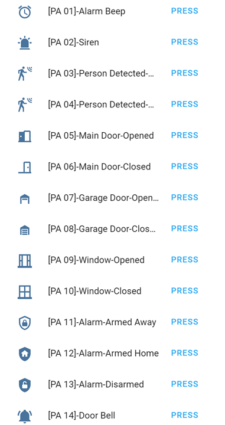
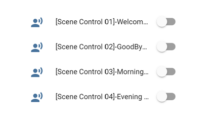
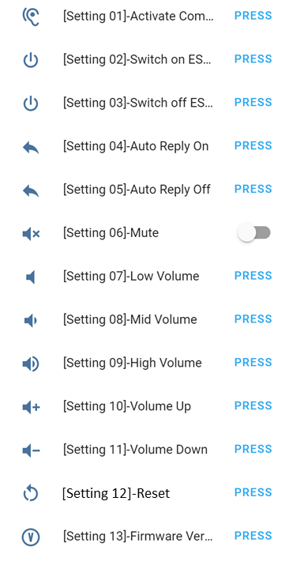

Extra Features
==============

Extra Feature 1: Public Annoucement System
------------------------------------------

ESPVoice can play 14 different predefined annoucements via a button-pressed in HA/ESPHome. The 14 predefined phrases are listed in table below:

+------+-----------------------------+
| ID   | Description                 |
+======+=============================+
| PA01 | Alarm beep                  |
+------+-----------------------------+
| PA02 | Siren                       |
+------+-----------------------------+
| PA03 | Someone is at the main door |
+------+-----------------------------+
| PA04 | Someone is at the backyard  |
+------+-----------------------------+
| PA05 | Main door is opened         |
+------+-----------------------------+
| PA06 | Main door is closed         |
+------+-----------------------------+
| PA07 | Garage door is opened       |
+------+-----------------------------+
| PA08 | Garage door is closed       |
+------+-----------------------------+
| PA09 | Window is opened            |
+------+-----------------------------+
| PA10 | Window is closed            |
+------+-----------------------------+
| PA11 | Alarm is armed away         |
+------+-----------------------------+
| PA12 | Alarm is armed home         |
+------+-----------------------------+
| PA13 | Alarm is disarmed           |
+------+-----------------------------+
| PA14 | Door Bell                   |
+------+-----------------------------+

Extra Feature 2: Scene Confirmation Controls 
--------------------------------------------

Scene confirmation control is configured to control Home Assistant scenes using ESPVoice without needing to say the wake words. Scene confirmation control is triggered when an external event has occurred, for e.g. door is opened, time is at 10:00pm or etc. ESPVoice would then ask for confirmation from user prior to activating the scene. The example below demonstrates the difference between voice commands and scene confirmation controls:

| **Voice command scenario**
| For voice commands, users is required to say the wake word to wake up ESPVoice, followed by a voice command to to trigger an action. For example: 

  |  User: "Hi ESPVoice"
  |  ESPVoice: "I’m here" 
  |  User: "Switch on Bedroom’s lights"
  |  ESPVoice: "Okay"

| **Scene confirmation controls**
| Scene confirmation controls can be triggered by any sensor, switch, button, time, event...etc in Home Assistant. After it is triggered, ESPVoice would ask for confirmation from user prior to executing any instruction set by the user. For example:

  | Event: Door sensor is opened
  | ESPVoice: "Do you want to activate Welcome Scene?" 
  | User: "Yes Please"
  | ESPVoice: "Welcome Scene is activated"

Extra Feature 3: ESPVoice for Emergency
-----------------------------------------

ESPVoice has dedicated one voice recognition slot to trigger "Emergency" state in Home Assistant, catering for any emergency event that may occur. Once emergency state is triggered, ESPVoice will increase the speaker volume to maximum and play a siren sound for 3 seconds. At the same time, ESPVoice will send a "911" text to Home Assistant, i.e. sensor.espvoicecontrol.state = "911". Further automations can be linked to this emergency state via automation in Home Assistant. 

The voice command to trigger the emergency state can be customized and trained using user own phrase, language or dialects.   

Extra Features 4: Additional commands
-----------------------------------------

ESPVoice provides a few setting options to customize for different applications and environments. All these settings can be done via Home Assistant dashboard.

* Activate Voice Recognition
* Switch on/off Speech Detection
* Switch on/off Command reply
* Check firmware version
* Set volume to Low, Medium & Low
* Mute and unmute speaker
* Restart ESPVoice Module

