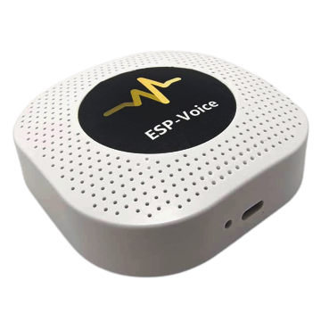
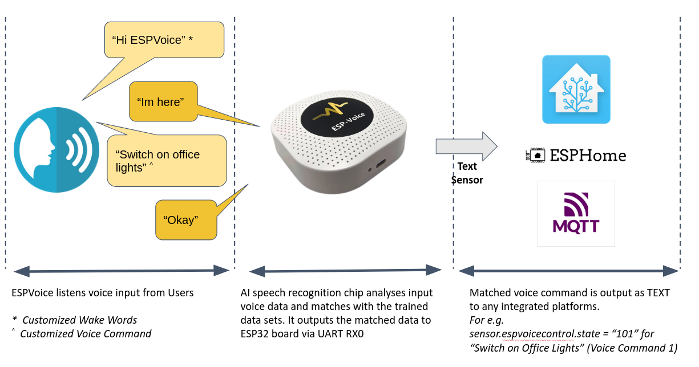

Introduction
=====================

The ESPVoice is a smart offline speech recognition device which is developed to work under ESPHome and Home Assistant platforms. It is equipped with an offline voice recognition module to perform speech detection and recognition for smart home applications. In addition, the voice recognition module is configured to execute self-learning exercises, to improve speech detection and recognition, from any language or dialects used by the users. All the detection and recognition outputs are transmitted to ESPHome or Home Assistant via an ESP32 module. 

Compare to existing smart speakers, ESPVoice offers the following advantages:

* **Fast Recognition:** Built-in AI speech recognition module for instant local speech detection and recognition. No internet required!
* **Customized Recognition:**  Customize your own voice commands and activate it with any name you want! AI speech recognition module is trained using user's own voices in any languages or dialects. 
* **Fully open source and customizable:** Integrated with an ESP32 module for WIFI & Bluetooth data communication. Good compatibility with any open-source platforms!  

Features
---------

* Self-learning capability: Recognition AI can be trained using your voice in any languages or dialects  
* 12 x Customizable Voice Control Commands
* 1 x Customizable Wake Word/Phrase 
* 1 x Call for Emergency Help
* 4 x Scene Confirmation Controls 
* 14 x Standard announcements used for PA system
* ESP32 provides WiFi/Bluetooth connectivity
* Bluetooth Proxy for Home Assistant
* Attached with a mono 3W tweeter for speech recognition response and PA applications
* Flashable with your own ESP device settings
* Powered with USB-C Port (Power supply unit is not supplied)

How does it work?
-----------------

  
ESPVoice can detect 1 customizable wake words and recognize up to 13 customizable voice commands. 

**Wake words**

The wake word for ESPVoice is fully customizable and can set to any languages, for e.g. "Hey ESPVoice", "Jarvis", "Sr. Elástico" etc, as long as you can pronounce it! After the ESPVoice is powered up for the first time, wake word learning process will be started. Users are instructed to speak the "Wake words" for 3 times, to complete the wake word learning and to activate the device.

For more information, see :ref:`learn_wake_words`.

**Voice commands**

ESPVoice can be trained to recognize 12 customizable action voice commands + 1 "call-for-emergency" voice command. Users can initiate the learning of each customizable voice command by pressing the "Learning Voice Command" buttons in Home Assistant/ESPHome interface. 

For more information, see :ref:`learn_voice_command`.

**Voice Detection and Recognition**

ESPVoice works in two-stages, Detection Stage and Recognition Stage. At rest, ESPVoice is in Detection Stage, i.e. ESPVoice is constantly listening to the wake-word (which was set in the learning process earlier).  Once the "wake-word" is detected, ESPVoice will enter into Recogntion Stage where ESPVoice is alerted to recognize any voice captured from the built in microphone. If the voice data matches with the voice-learning database (which was built during the voice command learning process earlier), ESPVoice will output the corresponding command code via a TEXT sensor to Home Assistant/ESPHome. 

For example if "Switch on Kitchen lights" was recognized, ESPVoiceControl text sensor will output "101" to represent "Voice Control 01"; if "Off living room heaters" was recognized, ESPVoiceControl text sensor will output "102" to represent "Voice Control 02" etc. Table belows demonstrate the text sensor outputs for each voice control commands. If no voice command is detected for more than 10 seconds, ESPVoice goes back to Detection Stage.
The output for corresponding voice command are summarized in :ref:`espvoice_control_text_output`

Similarly, users can set any Emergency Phrase to trigger Emergency Action in ESPVoice. For e.g. "Call 911", "Jarvis call for Help", etc. Once Emergency phrase is detected, ESPVoice will set the volume to Maximum and play a Siren Tune for 3 sec, and simultaneously output "911" to ESPVoice control text sensor to Home assistant for further action.

Head on to the next section to :ref:`get started <getting-started>` with ESPVoice!