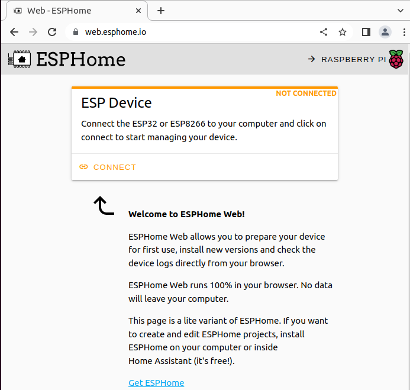

Software and driver
===================

ESPVoice Driver
---------------
The ESP32 board inside ESPVoice uses CH340 usb chip.
The driver for CH340 are available from the link below:

* |Windows|
* |iOS|

.. |Windows| raw:: html

   <a href="https://www.wch.cn/downloads/CH341SER_ZIP.html" target="_blank">Windows</a>

.. |iOS| raw:: html

   <a href="https://www.wch.cn/downloads/CH341SER_MAC_ZIP.html" target="_blank">iOS</a>

Programming ESPVoice
--------------------

ESPHome Web requires a browser that supports WebSerial. Please open this website on your desktop using Google Chrome or Microsoft Edge. 
|esphome|

.. |esphome| raw:: html

   <a href="https://web.esphome.io/" target="_blank">https://web.esphome.io/</a>

